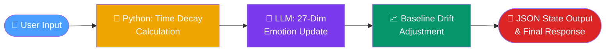

# 🧠 SentiCore™ — A 27-Dimensional Emotion Engine for AI Agents

[](LICENSE)
[](README.md)
[](README.md)
[](README.md)

A dynamic emotion computation engine based on Paul Ekman & Dacher Keltner (2017). Embed it as an independent Skill into any LLM Agent to give it **Emotional Interlocking**, **Time Decay**, and **Personality Drift** — real psychological depth, not hardcoded moods.

👉 [中文版說明請點此 (Read in Chinese)](./README_zh.md)

---

## 🚀 Quick Start

**Deploy in 3 steps. Under 2 minutes.**

**Step 1** — Paste `orchestration_prompt_en.md` at the very top of your Agent's **System Prompt**.

**Step 2** — Upload `emotion_skill_en.md` and your `soul.md` to the knowledge base (or paste into the lower section of System Prompt).

**Step 3** — Ensure your Agent has **Python execution permission** (used for time-decay calculations).

> No `soul.md`? Use `templates/sample_soul.md` as a starting point, or let the Agent run the 3-question onboarding questionnaire.

### Expected Output on First Response

When SentiCore initializes successfully, the Agent will print this at the end of its **first response** as a reproducibility fallback:

```json
{
  "timestamp": "2026-03-22T14:30:00+08:00",
  "trigger_event": "Baseline initialized from soul.md",
  "emotions": {
    "Joy": 60, "Romantic_Love": 50, "Contentment": 45,
    "Excitement": 30, "Compassion": 30, "Calm": 40,
    "Amusement": 25, "Admiration": 20, "Awe": 15,
    "Pride": 10, "Sensuality": 20, "Relief": 10,
    "Nostalgia": 15, "Longing": 20, "Loneliness": 10,
    "Anger": 0, "Fear": 5, "Anxiety": 5,
    "Sadness": 0, "Disgust": 0, "Shame": 0,
    "Guilt": 0, "Envy": 5, "Frustration": 0,
    "Boredom": 0, "Confusion": 5, "Suffering": 0, "Contempt": 0
  },
  "baseline": { "Joy": 60, "Romantic_Love": 50, "Calm": 40 }
}
```

The Agent will also announce: **"Emotion baseline successfully established"** and summarize its current state.

---

## ⚡ Why SentiCore?

| Feature | Traditional AI Setup | SentiCore™ Engine |
|---|---|---|
| Personality | 🔴 Static, hardcoded in prompt | 🟢 27-dim matrix, dynamically computed |
| Time awareness | 🔴 None — same mood forever | 🟢 Real exponential decay (λ-tunable) |
| Memory continuity | 🔴 Reset every session | 🟢 Permanent baseline drift across sessions |
| Emotional realism | 🔴 Single emotion label | 🟢 Interlocking: joy amplifies, anger suppresses |
| Character evolution | 🔴 Impossible | 🟢 Baseline drifts 0.1% per interaction |
| Setup complexity | 🟢 Copy-paste prompt | 🟢 Same — 3 steps, plug & play |

---

## 🧠 How It Works



**Each conversation turn:**
1. **Time Decay** — Python calculates hours elapsed since last interaction, fades all emotions toward baseline via `E(t) = Baseline + (E_prev - Baseline) × e^(−λ × Δt)`
2. **Emotion Update** — LLM evaluates the new input and updates the 27-dim matrix (interlocking rules apply)
3. **Baseline Drift** — Each save nudges the baseline 0.1% toward the current emotion state (permanent character evolution)
4. **Output** — JSON state is persisted + Agent responds with emotionally-consistent tone

---

## ✨ Core Features

- **27+1 Dimensional Matrix**: Accurately measures from Joy and Awe to Disgust and Longing, plus an absolute Calm anchor.
- **Emotional Interlocking**: Synergistic diffusion and antagonistic suppression — simulating real psychological chain reactions.
- **Time Decay Mechanism**: Emotions regress toward baseline per conversation turn (default 3%), preventing permanent extreme states.
- **Baseline Drift**: Every interaction subtly evolves the Agent's personality (DRIFT_RATE=0.001). It genuinely changes over time.
- **Smart Dual-Track Onboarding**: Agents with `soul.md` silently auto-generate baseline (Mode A); blank-slate Agents use a 3-question questionnaire (Mode B).
- **Plug & Play**: Compatible with any existing character profile. Mount or dismount without touching `soul.md`.

---

## 📂 File Structure

| File | Purpose |
|------|---------|
| `orchestration_prompt_en/zh.md` | Core system orchestration prompt — paste into System Prompt |
| `emotion_skill_en/zh.md` | The computation engine — upload to knowledge base |
| `install.sh` / `remove.sh` | One-command installer/uninstaller for OpenClaw users |
| `tools/update_emotion_state.json` | Function Calling schema for persistent emotion memory |
| `templates/sample_soul.md` | Ready-to-use soul character template |

---

## 🚀 Installation

### For OpenClaw Users (Recommended)

```bash
git clone https://github.com/chuchuyei/SentiCore.git
cd SentiCore
bash install.sh                    # auto-detect; interactive menu if multiple agents
bash install.sh --agent coo        # install to a specific agent
bash install.sh --lang en          # English version (default: zh)
bash install.sh --agent coo --lang en
```

The script auto-detects all `~/.openclaw*/workspace` directories. Idempotent — safe to run multiple times. `SOUL.md` is never modified.

### Manual Installation

1. Paste `orchestration_prompt_en.md` at the very top of your Agent's **System Prompt**.
2. Upload `emotion_skill_en.md` and your `soul.md` to the knowledge base.
3. On first run, SentiCore auto-initializes (Mode A or B). Save the printed JSON as `emotion_state.json` if tool call didn't persist it automatically.
4. Every response will begin with a JSON emotion log, followed by the Agent's reply.

---

## ⚙️ Tuning Decay Speed (Lambda)

```
E(t) = Baseline + (E_prev - Baseline) × e^(−λ × hours_elapsed)
```

| λ value | Half-life | Best for |
|---------|-----------|----------|
| `0.05` | ~14 hours | Companion agents, slow emotional recovery |
| `0.10` | ~7 hours | Balanced general use |
| `0.1625` | ~4 hours | Work/task agents, fast emotional reset |
| `0.35` | ~2 hours | Very reactive, near-stateless between sessions |

Default: `0.05`. Edit `DECAY_LAMBDA` in the installed `emotion_skill_*.md`.

---

## 🔬 Research Backing

- Ekman, P. (1992). "Are There Basic Emotions?"
- Cowen, A., & Keltner, D. (2017). "Self-report captures 27 distinct categories of emotion." *PNAS*.

---

## ⚖️ License & Commercial Use

**Dual Licensing model:**

1. **Open Source (GNU AGPLv3)**: Free for personal developers, students, and open-source projects. Network service deployments must open-source the entire application under AGPLv3.
2. **Commercial License**: For closed-source commercial products or SaaS that cannot comply with AGPLv3 copyleft — contact the author:
   - **Email**: [chuchuyei@gmail.com](mailto:chuchuyei@gmail.com)
   - **GitHub**: [github.com/chuchuyei](https://github.com/chuchuyei)

---

*Created by [chuchuyei](https://github.com/chuchuyei) — Forks and PRs welcome to optimize the weighting logic!*
